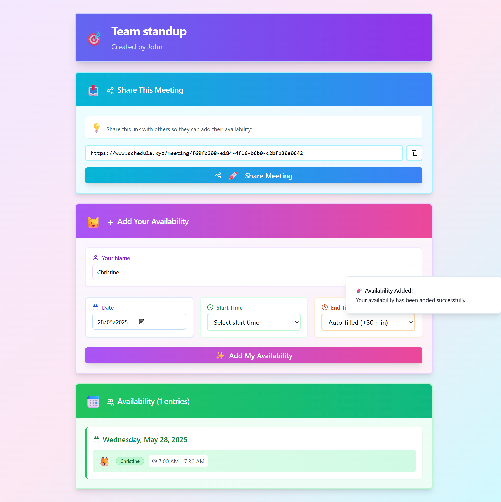

# Schedula: Effortless Meeting Coordination

Schedula is a web application designed to simplify the process of finding the perfect meeting time for a group of people. Users can create a meeting event, share a unique link, and participants can then indicate their availability. Schedula visualizes all submitted availabilities, making it easy to identify overlapping times that work for everyone.



## ✨ Features

- **Create Meetings:** Quickly set up a new meeting event with a title and your name.
- **Shareable Links:** Each meeting gets a unique URL to share with participants.
- **Add Availability:** Participants can easily mark their available dates and time slots.
- **Visual Availability Overview:** View all submitted availabilities grouped by date and time to find common slots.
- **Automatic End Time Calculation:** When a user selects a start time, the end time is auto-suggested (e.g., +30 minutes).
- **Participant Name Persistence:** Remembers the participant's name using local storage for convenience when adding multiple availabilities.
- **Responsive Design:** Works seamlessly on desktop and mobile devices.
- **User-Friendly Interface:** Clean and intuitive UI built with shadcn-ui and Tailwind CSS.

## 🚀 Tech Stack

- **Frontend:**
  - [Vite](https://vitejs.dev/): Fast build tool and development server.
  - [React](https://reactjs.org/): JavaScript library for building user interfaces.
  - [TypeScript](https://www.typescriptlang.org/): Typed superset of JavaScript.
  - [shadcn-ui](https://ui.shadcn.com/): Beautifully designed components.
  - [Tailwind CSS](https://tailwindcss.com/): Utility-first CSS framework.
  - [React Router](https://reactrouter.com/): Declarative routing for React.
  - [Lucide React](https://lucide.dev/): Simply beautiful open-source icons.
- **Backend & Database:**
  - [Supabase](https://supabase.io/): Open-source Firebase alternative (PostgreSQL database, Authentication, Realtime subscriptions).
- **Package Manager:**
  - [Bun](https://bun.sh/) (preferred, `bun.lockb` present)
  - [npm](https://www.npmjs.com/) (also supported)

## 🔧 Local Development Setup

To get Schedula running on your local machine, follow these steps:

**Prerequisites:**

- [Node.js](https://nodejs.org/) (LTS version recommended)
- [Bun](https://bun.sh/docs/installation) (Optional, but recommended if you have `bun.lockb`) or npm (comes with Node.js)
- [Git](https://git-scm.com/)

**1. Clone the Repository:**

```bash
git clone <YOUR_GIT_URL>
cd meet-sync-share-now
```

Replace `<YOUR_GIT_URL>` with the actual Git URL of this repository.

**2. Supabase Setup:**

Schedula uses Supabase for its backend and database.

- **Create a Supabase Project:**
  - Go to [Supabase](https://supabase.com/) and create a new project.
  - Save your **Project URL** and **anon (public) key**.
- **Database Schema:**
  - Navigate to the "SQL Editor" in your Supabase project dashboard.
  - Execute the SQL scripts found in the `supabase/migrations` directory (if it exists, or you'll need to define the `meetings` and `availability` tables as per `src/integrations/supabase/types.ts`).
  - Alternatively, you can manually create the `meetings` and `availability` tables based on the structure inferred from the application code (see `src/integrations/supabase/types.ts` and component interactions).
    - `meetings` table: `id` (uuid, primary key), `title` (text), `creator_name` (text), `created_at` (timestamp with time zone), `updated_at` (timestamp with time zone).
    - `availability` table: `id` (uuid, primary key), `meeting_id` (uuid, foreign key to `meetings.id`), `participant_name` (text), `available_date` (date), `start_time` (time without time zone), `end_time` (time without time zone), `created_at` (timestamp with time zone).
- **Configure Environment Variables:**

  - The Supabase client is initialized in `src/integrations/supabase/client.ts`.
  - It directly uses the Supabase URL and public key. For local development, this is often fine.
  - **IMPORTANT FOR PRODUCTION:** For a production deployment, you should use environment variables to store your Supabase URL and anon key. Update `src/integrations/supabase/client.ts` to read these from `process.env` or `import.meta.env` (for Vite).

    - Create a `.env` file in the root of your project (and add `.env` to `.gitignore`!).
    - Add your Supabase credentials to the `.env` file:
      ```
      VITE_SUPABASE_URL=YOUR_SUPABASE_PROJECT_URL
      VITE_SUPABASE_ANON_KEY=YOUR_SUPABASE_ANON_KEY
      ```
    - Modify `src/integrations/supabase/client.ts` to use these variables:

      ```typescript
      // src/integrations/supabase/client.ts
      import { createClient } from "@supabase/supabase-js";
      import type { Database } from "./types";

      const SUPABASE_URL = import.meta.env.VITE_SUPABASE_URL;
      const SUPABASE_PUBLISHABLE_KEY = import.meta.env.VITE_SUPABASE_ANON_KEY;

      export const supabase = createClient<Database>(
        SUPABASE_URL!,
        SUPABASE_PUBLISHABLE_KEY!
      );
      ```

**3. Install Dependencies:**

Using Bun (if `bun.lockb` is present and you have Bun installed):

```bash
bun install
```

Or using npm:

```bash
npm install
```

**4. Start the Development Server:**

Using Bun:

```bash
bun run dev
```

Or using npm:

```bash
npm run dev
```

This will start the Vite development server, typically at `http://localhost:5173`.

## 🚀 Deployment

This project is configured for easy deployment with [Vercel](https://vercel.com/).

- **Connect Your Git Repository:**
  - Sign up or log in to [Vercel](https://vercel.com/).
  - Create a new project and connect it to your Git repository (e.g., GitHub, GitLab, Bitbucket).
- **Configure Build Settings:**
  - Vercel should automatically detect that this is a Vite project.
  - The typical build command is `npm run build` (or `bun run build`).
  - The output directory is `dist`.
- **Add Environment Variables:**
  - In your Vercel project settings, add the Supabase environment variables:
    - `VITE_SUPABASE_URL`: Your Supabase Project URL
    - `VITE_SUPABASE_ANON_KEY`: Your Supabase anon (public) key
- **Deploy:**
  - Vercel will automatically build and deploy your project when you push changes to the connected branch (e.g., `main` or `master`).

The `vercel.json` file in this repository provides basic configuration for Vercel deployments.

## 🤝 Contributing

Contributions are welcome! If you have suggestions or want to improve Schedula, please feel free to:

1.  Fork the repository.
2.  Create a new branch (`git checkout -b feature/your-feature-name`).
3.  Make your changes.
4.  Commit your changes (`git commit -m 'Add some feature'`).
5.  Push to the branch (`git push origin feature/your-feature-name`).
6.  Open a Pull Request.

## 📄 License

This project is open-source and available under the MIT License.
